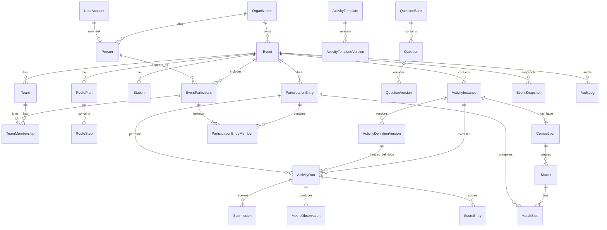

# Domain Model

## 1. Bounded contexts

### Organization & Identity

- Organization
- UserAccount
- Person
- EventParticipant
- EventRole
- CapabilityGrant

### Event Design

- Event
- EventPhase
- Team
- TeamMembership
- Station
- RoutePlan / RouteStep
- ActivityTemplate / TemplateVersion
- ActivityInstance / ActivityDefinitionVersion
- QuestionBank / Question / QuestionVersion

### Runtime

- ParticipationEntry
- ActivityRun
- Submission
- MetricObservation
- VerificationDecision
- RuleExecution
- StationVisit / QueueEntry
- TimerRecord

### Scoring & Competition

- ScoreEntry
- Placement
- Competition
- Match
- MatchSide
- Advancement

### Governance

- EventSnapshot
- RandomizationRecord
- AuditLog
- DomainEvent / OutboxEvent
- MediaAsset
- Incident

## 2. Key modeling distinction

```text
DEFINITION                         EXECUTION
-------------------------------    ---------------------------------
ActivityInstance                   ActivityRun
ActivityDefinitionVersion          Submission
QuestionVersion                    MetricObservation
ScoringDefinition                  ScoreEntry
RuleDefinition                     RuleExecution
Station/Route config               StationVisit / QueueEntry
Competition config                 Match / MatchSide / Advancement
```

Definitions say **what should happen**. Runtime records say **what actually happened**.

## 3. Identity model

A person may exist without an account.

```text
Person
  1 ───── 0..1 UserAccount link
  1 ───── * EventParticipant
                  * ───── 1 Event
                  * ───── * TeamMembership
```

This supports:

- organizer-imported employee roster;
- participants who never create/login to an account;
- a participant later linking/claiming an account;
- event-specific display name/status without mutating the canonical person.

## 4. ParticipationEntry — the universal activity actor

Different activities may involve:

- whole team;
- individual;
- pair;
- selected representatives;
- subgroup;
- temporary side in a match.

Use `ParticipationEntry` as the runtime actor abstraction.

```text
ParticipationEntry
- id
- eventId
- kind: TEAM | INDIVIDUAL | PAIR | SUBGROUP | AD_HOC
- teamId?                 // optional owning/source team
- label?
- metadata

ParticipationEntryMember
- entryId
- eventParticipantId
- role?                   // optional captain/runner/representative/etc.
```

A `TEAM` entry may reference the Team and resolve current members according to a snapshot policy. A `PAIR/SUBGROUP` explicitly stores members.

All `ActivityRun`, `MatchSide`, and relevant result rows reference `ParticipationEntry` instead of duplicating team-vs-individual logic everywhere.

## 5. Event structure

```text
Event
 ├─ EventPhase*
 ├─ Team*
 │   └─ TeamMembership*
 ├─ Station*
 ├─ RoutePlan*
 │   └─ RouteStep*
 ├─ ActivityInstance*
 │   └─ ActivityDefinitionVersion*
 ├─ Competition*
 ├─ EventRole*
 ├─ EventSnapshot*
 └─ AuditLog*
```

## 6. Activity definition model

```text
ActivityTemplate
 └─ ActivityTemplateVersion*

Event
 └─ ActivityInstance
      └─ ActivityDefinitionVersion*
            definitionJson
            schemaVersion
            checksum
```

`ActivityInstance` is a stable event-owned identity. Versions are immutable published definitions.

A definition contains references/config for:

- participation policy;
- content blocks;
- question source/draw specs;
- metrics;
- verification;
- timers;
- attempts;
- scoring;
- rules;
- progression;
- safety/accessibility metadata.

## 7. Questions/content

```text
QuestionBank
 └─ Question*
      └─ QuestionVersion*
```

A question's current editor state is not what a live event trusts. A locked event references immutable `QuestionVersion` IDs or a stored random draw of versions.

Arbitrary answer-choice count is an array in the version definition—not columns `choiceA/choiceB/choiceC/choiceD`.

## 8. Stations and routes

```text
Station
 ├─ station metadata/config
 └─ StationActivityAssignment*

RoutePlan
 └─ RouteStep*
      ├─ stationId?
      ├─ activityInstanceId?
      └─ prerequisites / behavior

TeamRouteAssignment
- teamId
- routePlanId
- generatedSnapshot/version
```

Route steps may point to a station, an activity, a logical gate, or a combination depending on the route type.

## 9. Activity execution

```text
ActivityRun
- eventId
- activityInstanceId
- activityDefinitionVersionId
- participationEntryId
- attemptNo / roundKey / matchId?
- state
- startedAt / completedAt
- generatedContentRef?

ActivityRun
 ├─ Submission*
 ├─ MetricObservation*
 ├─ VerificationDecision*
 ├─ ScoreEntry*
 └─ RuleExecution*
```

## 10. Submission model

A submission belongs to one activity run and normally one block/question target.

```text
Submission
- activityRunId
- targetKey              // stable block/question key within definition/snapshot
- payloadJson            // typed according to renderer schema
- clientSubmittedAt?
- serverReceivedAt
- status
- idempotencyKey?
```

Do not trust client-calculated correctness or score.

## 11. Result/metric model

```text
MetricObservation
- activityRunId
- metricKey
- metricType
- numericValue?
- booleanValue?
- textValue?
- jsonValue?
- unit?
- source
- observedAt
- verificationStatus
```

Examples:

- `elapsed_ms = 73420`
- `volume_ml = 850`
- `violations = 2`
- `correct_count = 12`
- `marshal_pass = true`

## 12. Scoring model

```text
MetricObservation(s)
     ↓
Scoring Definition
     ↓
Derived ScoreEntry(s)
     ↓
Placement Calculation
     ↓
Event Aggregation
```

Manual bonus/penalty/override entries are ledger rows, not destructive edits to raw metrics.

## 13. Competition model

```text
Competition
- activityInstanceId
- formatType
- configJson

Competition
 └─ Match*
      └─ MatchSide* -> ParticipationEntry
```

Competition-format plugins produce/advance generic matches. A tug-of-war bracket and a mental duel can use the same competition runtime.

## 14. Audit and domain events

`AuditLog` answers **who changed what and why**.

`DomainEvent/OutboxEvent` answers **what happened that other engine processes may react to**.

Examples:

- audit: `SCORE_OVERRIDE_APPLIED`
- domain event: `ACTIVITY_RUN_COMPLETED`

Keep them conceptually separate even if implementation shares infrastructure.

## 15. High-level ERD



## 16. Anti-patterns explicitly rejected

Do not create:

- `AmazingRaceStationResult`
- `SackRaceResult`
- `QuizBeeAnswerA/B/C/D`
- `WaterRelayScore`
- `Team1`, `Team2`, `Team3` columns
- `firstPlacePoints`, `secondPlacePoints`, `thirdPlacePoints` columns
- `if activity.name === ...`

Represent these through generic definitions, metrics, score rules, and runtime rows.
